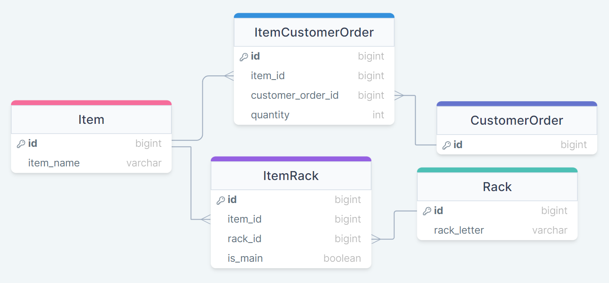
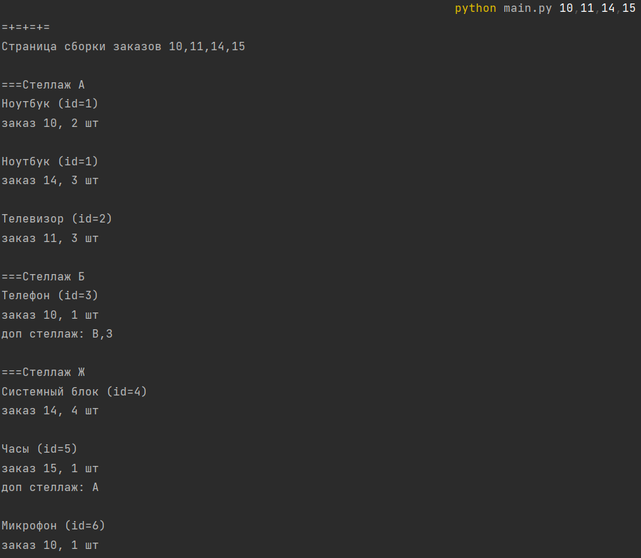

# ItemLocator App

**This console application is capable of 
locating warehouse items from given 
orders and grouping them by the corresponding racks**

## 💪Built with


## ✨Give it a try

*Expected to use **Bash** or similar shell alternatives*

*Expected that user already have **populated PostgreSQL database** with corresponding schema*

<br>

clone repo >> generate .env >> edit it

```bash
git clone https://github.com/Kimoi/ItemLocator-App.git && \
cd ItemLocator-App && \
cp env_example .env && \
nano .env
```

<br>

Activate venv Linux / macOS

`python -m venv venv && source venv/bin/activate`

Activate venv Windows

`python -m venv venv && source venv/Scripts/activate`

<br>

Install requirements

```bash
python -m pip install --upgrade pip && \
pip install -r requirements.txt
```

## ⚡Database schema



## 🪄Usage example

Type

`python main.py 10,11,14,15`

Get



## ⚠️Erase project

`deactivate && cd .. && rm -fr ItemLocator-App`
